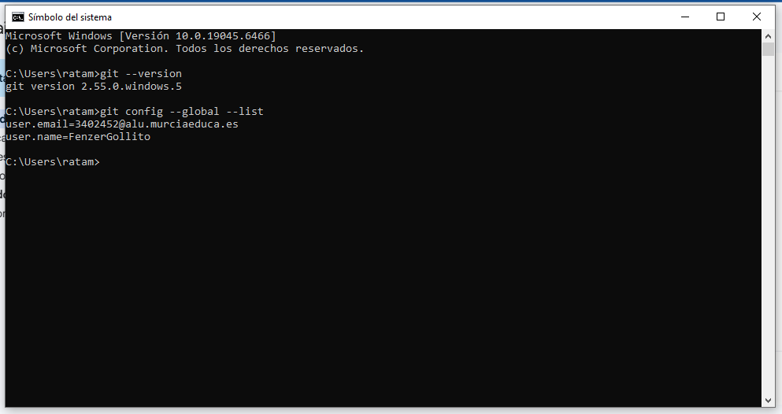
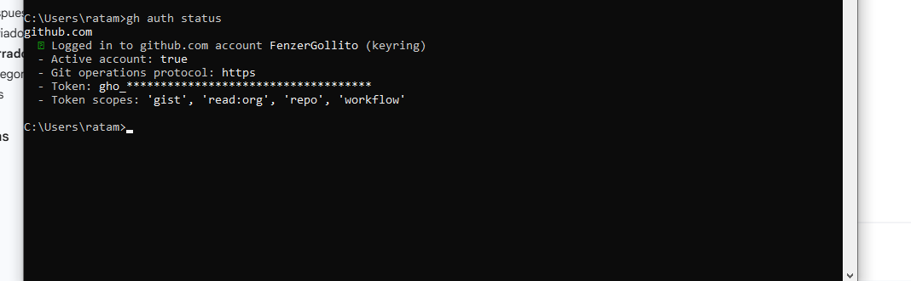
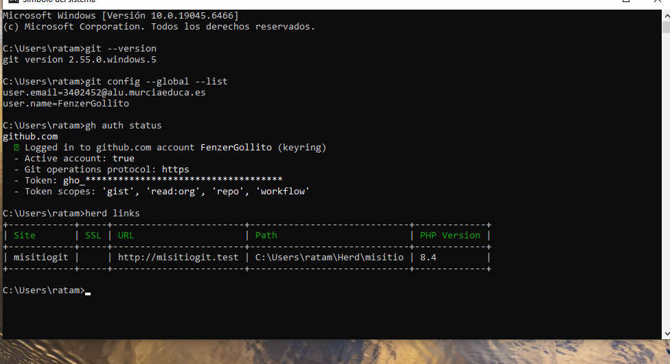
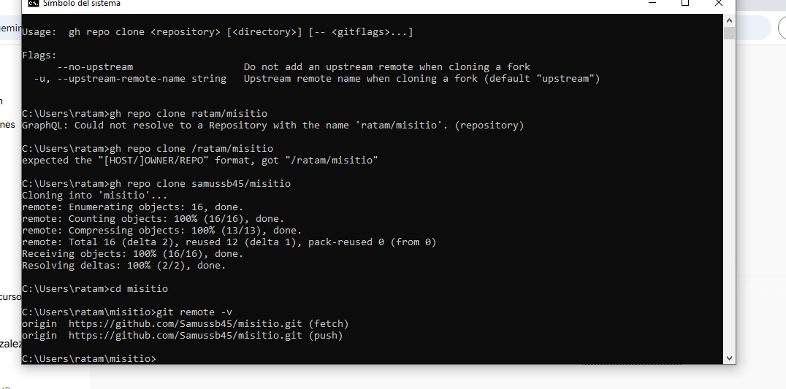

# Documentacion del Proyecto2627

## 1. Instalación y Configuración de Git
Se ha instalado Git en el sistema y se ha configurado correctamente para el control de versiones.

## 2. Autenticación con GitHub CLI
Se ha instalado y utilizado la herramienta de línea de comandos de GitHub para vincular y gestionar el repositorio desde la terminal.

## 3. Instalación de Herd
Se ha desplegado Laravel Herd en el equipo como entorno de desarrollo local para servir el proyecto de forma rápida.

## 4. Despliegue de "misitio" en Local con HTTPS
El proyecto local llamado "misitio" está funcionando correctamente y se le ha asegurado la conexión mediante un certificado SSL (HTTPS).
